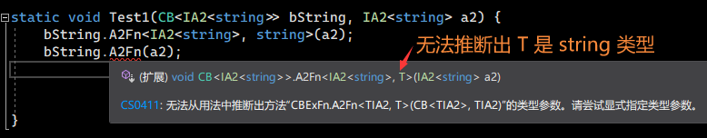
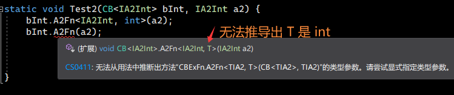

# C# - 泛型特化
## 问题：如何为特定类型提供一些方法实现？

``` csharp
interface IA { }
interface IAA : IA { }
interface IA2<T> : IA { }

class CB<TIA> where TIA : IA { }
// 需求：只要 CB<TIA> 的泛型参数 TIA 是 IA2<T> 的子类型，
// 则提供一个方法的实现: void A2Fn(T t); // T 的类型是 IA2<T> 的泛型参数 T
static void Test(CB<IA2<int>> bInt, CB<IA2<string>> bString) {
    // 以下类型都可以调用
    bInt.A2Fn(20210821);
    bString.A2Fn("20210821");
}
```
`CB<TIA>` 对泛型参数最小约束是 `IA`，方便让继承自 `IA` 的子类型（`IAA` , `IA2<T>`），都满足约束。对于方法 `void A2Fn(T t)` 的实现，如果 `TIA` 不是 `IA2<T>` 的子类型，我们不用提供实现。

`IA2<T>` 是 `IA` 的子类型，那我用面向对象的继承，对 `CB<TIA>` 再套一层继承进行特定的实现（`CB2<T>: CB<IA2<T>>`），是不是能达到效果？

``` csharp
interface IA { }
interface IAA : IA { }
interface IA2<T> : IA { }

class CB<TIA> where TIA : IA { }
// 需求：只要 CB<TIA> 的泛型参数 TIA 是 IA2<T> 的子类型，
// 则提供一个方法的实现: void A2Fn(T t); // T 的类型是 IA2<T> 的泛型参数 T

class CB2<T> : CB<IA2<T>> {
    public void A2Fn(T t) { }
}
static void Test(CB2<int> bInt, CB2<string> bString) {
    // 以下类型都可以调用
    bInt.A2Fn(20210821);
    bString.A2Fn("20210821");
}
```
有些效果了，甚至让 `CB2<T>` 看上去更简洁了，`CB2<T>` 的泛型参数就是 `IA2<T>` 的泛型参数。有些人可能问到「既然方法的实现约束是针对 `IA2<T>`，为什么不把 `void A2Fn(T t)` 这个实现约束放到 `IA2<T>` 接口里面？」，如果察觉到了，再来看一下 `CB<TIA>`，会发现 `CB<TIA>` 和 `IA2<T>` 没有直接的继承关系。

那么现在这个实现有什么问题吗？再来看下面的代码：

```csharp
interface IA { }
interface IAA : IA { }
interface IA2<T> : IA { }
interface IA2Int : IA2<int> { } // 注意这里

class CB<TIA> where TIA : IA { }
class CBString: CB<IA2<string>> { } // 注意这里
class CB2<T> : CB<IA2<T>> {
    public void A2Fn(T t) { }
}

static void Test(CB2<int> bInt, CB2<string> bString) {
    bInt.A2Fn(20210821);
    bString.A2Fn("20210821");
}
// 注意这个 Test2 函数 
static void Test2(CB<IA2Int> bInt, CB<IA2<string>> bString, CBString bString1) {
    bInt.A2Fn(20210821); // 没有找到方法
    bString.A2Fn("20210821"); // 没有找到方法
    bString1.A2Fn("20210821"); // 没有找到方法
}
```
`CB<IAInt>`, `CB<IA2<string>>`, `CBString` 对 `CB2<T>` 都不是继承关系，自然没有实现 `A2Fn` 方法，我们不能阻止别人一定要使用 `CB2<int>` 和 `CB<string` 去应对，甚至接口 `IA2Int` 可能有其他方法呢，`CBString` 也有其他方法实现。
我们对 `void A2Fn(T t)` 实现的最小约束是： `CB<TIA>` 的泛型参数 `TIA` 是 `IA2<T>` 的子类型，我们就提供实现。

我们来看一下上面代码的类型关系图：

``` 
           +-----------+                                +-----------+
           |    IA     |                                |   CB<TIA> |
           +-----+-----+                                +-----------+
                 |                                            |
       +---------+-----------+                      +---------+-----------+
       |                     |                      |                     |
+------v---+          +------v-----+         +------v---+          +------v-----+
|   IAA    |          |    IA2<T>  |         | CBString |          |    CB2<T>  |
+----------+          +------+-----+         +----------+          +------------+
                             |
                             |
                      +------v-----+
                      |    IAInt   |
                      +------------+
```
我们要提供得方法实现最好还是在 `CB<TIA>` 类上，仅仅针对 `TIA` 进行约束而已，但是又不想对该类本身的 `TIA` 约束放大到 `IA2<T>` 上。

单纯的使用继承是不可能实现了，除非可以在方法上对泛型进行约束（假设代码）：

``` csharp
class CB<TIA> where TIA : IA { 
    public void A2Fn(T t) where TIA : IA2<T> { } // 这当然编译不过了，C# 不支持
    public void A2Fn2(T t) where TIA : IA2<T> { } // 而且写起来累，有很多重复的代码
    public void A2Fn3(T t) where TIA : IA2<T> { }
}
```
可能很多人在开头已经想到了就是使用扩展方法，加上泛型约束即可：

``` csharp
interface IA { }
interface IAA : IA { }
interface IA2<T> : IA { }
interface IA2Int : IA2<int> { }

class CB<TIA> where TIA : IA { }
class CBString : CB<IA2<string>> { }
class CB2<T> : CB<IA2<T>> {
    public void A2Fn(T t) { }
}
static class CBExFn { // 注意这里
    public static void A2Fn<TIA2, T>(this CB<TIA2> self, T t) where TIA2 : IA2<T> { }
}
static void Test(CB<IA2Int> bInt, CB<IA2<string>> bString, CBString bString1) {
    bInt.A2Fn(20210821);
    bString.A2Fn("20210821");
    bString1.A2Fn("20210821");
}
```
目前的解决方案就是这样，但是还是有些不完美，扩展方法对类的成员有访问限制（`private`, `protected`），可以尝试着加 `internal` 修饰符进行处理。（注意：扩展方法和类本身的方法同时存在时，优先调用类本身的方法）

## 泛型特化
上面的扩展方法对泛型进行特殊约束就是一种泛型特化，它可以为特定类型提供特定实现，解决继承不能解决的代码重用问题。
可能很多人已经写过这种扩展方法了。在没接触这个概念之前我之前也写过类似的代码，然而我不知道这个概念，后来写了 `Rust` 才知道这个概念。顺着这个关键词也知道了 `C++` 有这个概念，本人不会 `C++`，可见多学一门语言对编程思想有多大的帮助。这个概念可以分为偏特化和全特化，可以看下面的代码：

``` csharp
static class CBExFn {
    // 偏特化，只要 TIA2 满足了类型约束，就提供实现，此时的 CB<TIA2> 还是一个泛型类
    public static void A2Fn<TIA2, T>(this CB<TIA2> self, T t) where TIA2 : IA2<T> { }
    
    // 全特化，对 CB<IA2<string>> 的类型提供了方法实现，
    // 此时 CB<IA2<string>> 已经是一个封闭的类型了
    public static void A2Fn(this CB<IA2<string>> self, string t) { }
}
```

## C# 泛型特化遇到的一些问题
1. 必须依托于扩展方法，一些类成员访问受到限制。
2. 由于 C# 还不支持高阶泛型，有些时候还要写泛型参数，写起来还比较累：

    ``` csharp
    interface IA { }
    interface IA2<T> : IA { }
    interface IA2Int : IA2<int> { }

    class CB<TIA> where TIA : IA { }

    // 扩展方法的静态类是不允许是泛型类的，所以泛型参数都要写在扩展方法上面
    static class CBExFn { 
        public static void A2Fn<TIA2, T>(this CB<TIA2> _, TIA2 a2) where TIA2 : IA2<T> { }
        //                                                ^^^^ 这里，参数变为 TIA2
    }
    ```
    
    

    这并不是泛型特化的问题，这是 C# 没支持高阶泛型的问题。
3. 不能对静态方法做抽象，以至于一些类型的特化没能做出来。
   
   举个例子，我要实现一个  `Point<T>`，只要 `T` 类型实现了加法操作符，这个 `Point<T>` 就能进行加法运算。

    ``` csharp
    class Point<T> { public T X; public T Y; }
    static void Test(Point<int> p1, Point<int> p2) {
        Point<int> p = p1 + p2;
    }
    static void Test(Point<float> p1, Point<float> p2) {
        Point<float> p = p1 + p2;
    }
    ```
   应该如何对这个 `T` 进行特化？目前还做不到，等这个提案实现：[Static abstract members in interfaces](https://github.com/dotnet/csharplang/issues/4436)，
   
   以 Rust 的实现作为示例
   （[Rust Playground](https://play.rust-lang.org/?version=stable&mode=debug&edition=2018&gist=175473360a7d9e60c843999e7193c634)），
   看看泛型特化的强大之处：
   ``` rust
   use std::ops::Add;

    #[derive(Debug)]
    struct Point<T> { x: T, y: T }

    // 为 Point<T> 进行特化实现
    impl<T: Add<Output = T>> Add for Point<T> {
        //   ^^^^^^ 这里已经约束了 T 必须实现 Add 运算符
        type Output = Point<T>;

        fn add(self, other: Point<T>) -> Point<T> {
            return Point {
                x: self.x + other.x,
                y: self.y + other.y,
            };
        }
    }

    fn main() {
        let p1: Point<i32> = Point{ x: 1, y: 2 };
        let p2: Point<i32> = Point{ x: 10, y: 20 };
        println!("{:?}", p1 + p2); // Point { x: 11, y: 22 }
        let p1: Point<f64> = Point{ x: 0.1, y: 0.2 };
        let p2: Point<f64> = Point{ x: 10.0, y: 20.0 };
        println!("{:?}", p1 + p2); // Point { x: 10.1, y: 20.2 }
    }

   ```


